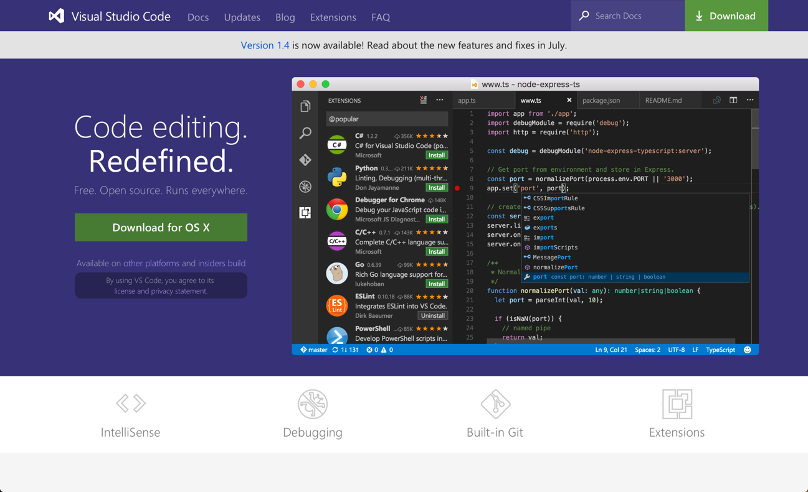

# Configurando el ambiente

Antes de arrancar, se necesitan tener las herramientas instaladas. No hay restricciones con respecto al sistema operativo (_Windows, Linux o Mac_) y al browser (_Microsoft Edge, Chrome, Safari, Firefox, etc._). 

Se requiere instalar _node.js_ y _npm_. Aparte de estas herramientas, se necesita un editor de texto (_Visual Studio Code, Sublime, Atom, Vim, etc._). 

A continuación se explica como instalar alguna de ellas.

## Instalar Chrome última versión

TBC

## IDE / Editor. Ejemplo Visual Studio Code

Para editar el código, se va a aprovechar _Visual Studio Code_, en especial porque permite trabajar en todas las plataformas y es gratuito. Igualmente, se puede usar su editor de texto preferido.

1. Navegar a [https://code.visualstudio.com](https://code.visualstudio.com) y descargar la versión correspondiente para tu plataforma.

    

    _Sitio de Visual Studio Code_

1. Una vez descargado, seguir los pasos de la instalación.

## Node.js & npm

Hoy en día existen muchas herramientas para el desarrollo web que aprovechan [node.js](https://nodejs.org) y [npm](https://www.npmjs.com). Por mas que no es requerido para el desarrollo de una PWA, nosotros usaremos algunas de estas herramientas y por eso es un requerimiento de este workshop. El primero sirve para poder correr las herramientas necesarias. El segundo, se necesita dado que es la forma en la se distribuye los paquetes que utilizaremos.

> **Nota**: Verificar que está instalada al menos la versión _4.x.x_ de _node.js_ y la versión _3.x.x_ de _npm_ corriendo `node -v` y `npm -v` en la terminal/consola.

1. Navegar al sitio de descargas de _node.js_: [https://nodejs.org/es/download/](https://nodejs.org/es/download/).

1. Seleccionar la versión _LTS (Long term support)_ y la plataforma correspondiente.

1. Una vez descargado, seguir los pasos de la instalación.

## Conclusiones

Con este tipo de herramientas se puede desarrollar desde cualquier plataforma (Windows, Mac o Linux) sin ningún problema, permitiendo una mayor flexibilidad.

Ahora que el entorno de desarrollo esta listo, no queda otra cosa que empezar a desarrollar las aplicaciones.