# 2. Entendiendo el proyecto

Durante todo el workshop vamos a trabajar sobre un sitio web existente que sirve para registrar gastos, agregando funcionalidad y actualizandola para convertirla en una Progressive Web App. En este módulo, vamos a recorrer la solución inicial para entender de que se trata, como también que tecnologías utiliza.

## Estructura del proyecto

Lo primero que vamos a ver es la estructura del proyecto. El mismo se trata de un proyecto web con un servidor hecho en [node.js](https://nodejs.org/en/) con [express](https://expressjs.com) y un cliente que usa JavaScript puro (sin frameworks) y [Bootstrap](http://getbootstrap.com).

Ahora, vamos a arrancar a revisar el proyecto mirando el código.

1. Primero, copiar la carpeta **code** localizada dentro de este módulo a algún lugar cómodo para poder trabajar (ejemplo: el escritorio o la carpeta de usuario).

1. Abrir la carpeta con _VS Code_ o la herramienta que prefiera para ver la estructura de archivos.

    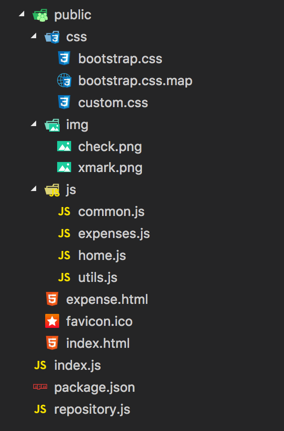

    _Estructura de la carpeta del proyecto_

1. Para recorrer el proyecto, vamos a arrancar abriendo el archivo _package.json_. Éste archvio es típico de un proyecto hecho en _node.js_ y contiene las dependencias e información del mismo.

1. Notar que en la el nodo `scripts`, está configurado el llamado _start_ ejecutando el archivo _index.js_.

  ```json
  "scripts": {
    "test": "echo \"Error: no test specified\" && exit 1",
    "start": "node index.js"
  },
  ```

1. Ahora, abrir el archivo _index.js_. Éste contiene el código del servidor donde se configura el uso de _express_ así como también las rutas de nuestra API.

1. Notar que al inicio del archivo se configura express de forma muy simple. Este archivo depende de _repository.js_, que es el otro archivo localizado en el mismo nivel.

    ```js
    const Repository = require('./repository');
    const bodyParser = require('body-parser');
    const express = require('express');
    const app = express();
    app.use(bodyParser.json());
    app.use(bodyParser.urlencoded({ extended: true }));
    app.use(express.static('public'));
    ```

    > **Nota**: Se configura el middleware de _bodyParser_ para urls y json y aparte se configura que los archivos de la carpeta public son estáticos, esto implica que el servidor está configurado para devolver estos archivos ante un pedido con la ruta especifica (un pedido a _/img/check.png_, devolverá ese archivo).

1. Abrir ahora el archivo _repository.js_. Este archivo contiene una implementación de un repositorio no persistente (los datos quedan en memoria mientras que el servidor esté corriendo).

    > **Nota**: Esta implementación está hecha solo para simplificar el workshop. Los datos se perderan cada vez que se apague el servidor.


1. En la carpeta public podemos encontrar las siguientes cosas:
    
    - _css_: Las hojas de estilos que son usados en el cliente. Estos incluyen [Bootstrap v4](http://getbootstrap.com) y algunos estilos propios.
    - _img_: Algunas imagenes que son usadas por el sitio.
    - _js_: Un archivo de js por cada página (_expenses.js_ y _home.js_) con la lógica propia de cada una. Aparte existe un archivo _common.js_ con todas las funciones compartidas por ambas páginas y donde se realizan las llamas al servidor. Por último un archivo _utils.js_ con algunas funciones que se usarán después.
    - _index.html_ y _expenses.html_: los archivos correspondientes a cada una de las vistas con el html básico de cada una. Idealmente en un proyecto se usaría algun engine de templates en el servidor para no duplicar el código (ejemplo: [pug](https://pugjs.org/)). Para mas información: [Using Template Engines](https://expressjs.com/en/guide/using-template-engines.html).

1. Antes de pasar a la siguiente tarea, recorrer un poco los archivos para ver que hay en cada uno a la hora de comenzar.

## Probando la solución

Ahora que ya vimos los archivos que contiene nuestra solución, las tecnologías utilizadas y exploramos un poco de la misma, vamos a proceder a verla en funcionamiento.

1. Primero, abrir una consola/terminal en la carpeta donde se haya copiado la solución.

1. Lo primero antes de iniciar el servidor, será asegurarnos de tener las dependencias, para esto, ejecutamos el siguiente comando.

    ```
    npm install
    ```

    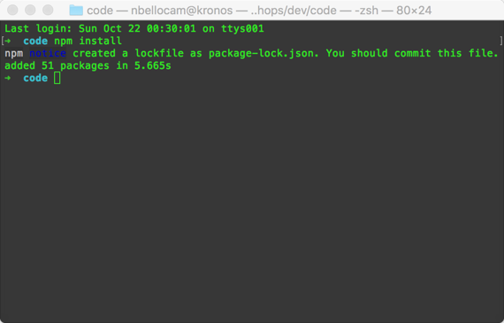

    _Resultado de ejecutar el comando_
    

1. Una vez que termine de instalar las dependencias, iniciaremos el servidor con el siguiente comando.

    ```
    npm start
    ```

    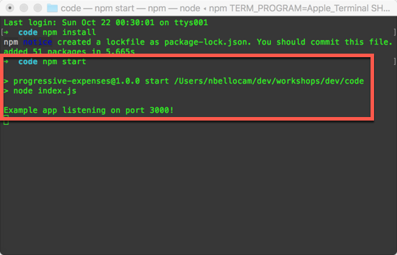

    _Resultado de ejecutar el comando_

1. Ahora, abrir el browser y navegar a [http://localhost:3000](http://localhost:3000).

    

    _Sitio funcionando_

1. Volver a la terminal para ver la salida del servidor. Notar que se realizó una llamada a la API con el método _GET_.

    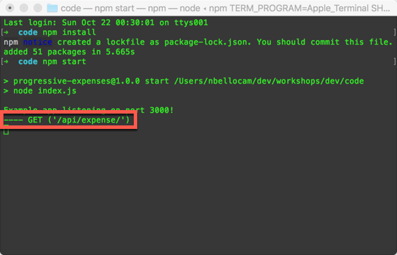

    _Salida del servidor_

1. Agregar un nuevo gasto haciendo click en el boton **Agregar gasto**.

    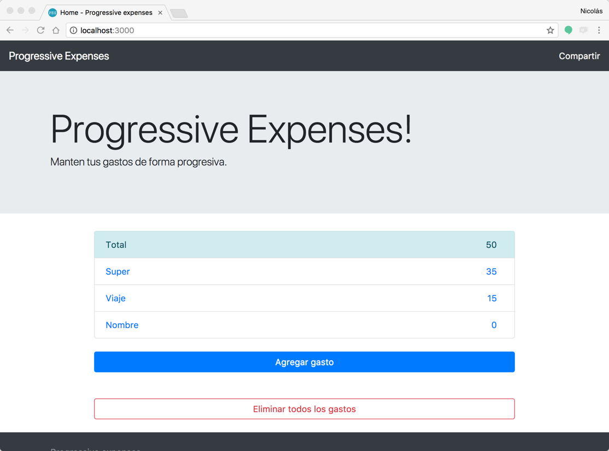

    _Resultado de clickear en agregar gasto_

1. Volver a la consola para ver que ocurrió esta vez.

    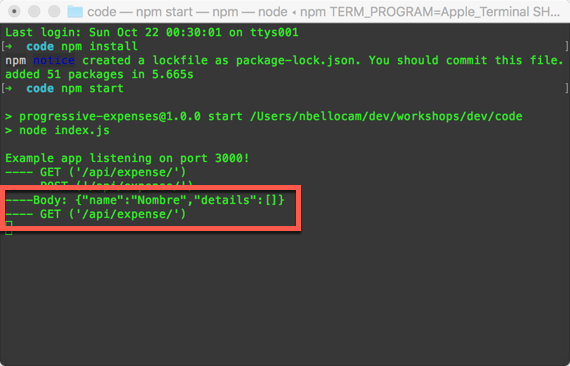

    _Salida del servidor después de agregar un nuevo gasto_

1. Hacer click en el nuevo nombre del item **Nombre** para ir al detalle del mismo.

    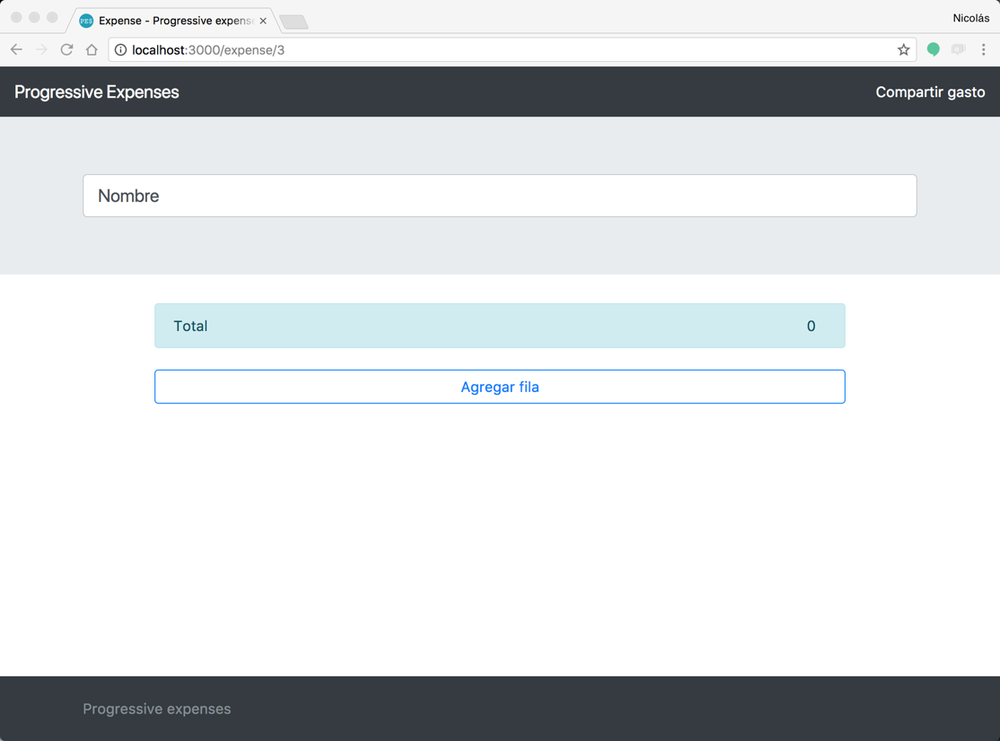

    _Detalle del nuevo gasto_

1. Nuevamente volver a la consola para ver el detalle de lo ocurrido.

    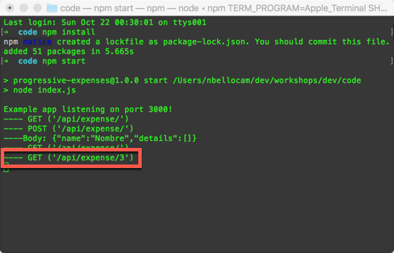

    _Salida del servidor después de navegar al nuevo gasto_

1. Cambiar el nombre al gasto por `Nuevo gasto` y volver a la consola para ver lo ocurrido.

    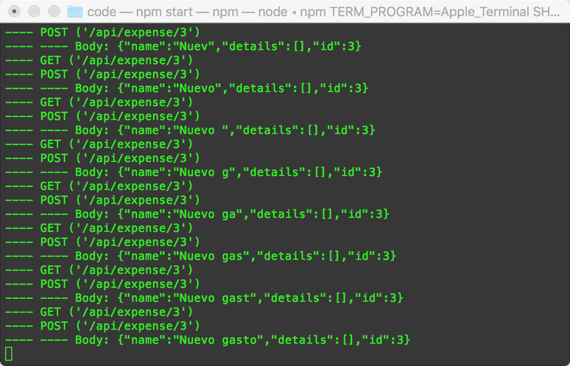

    _Salida del servidor después de modificar el titulo_

    > **Nota**: Esta forma de actualizar un titulo caracter por caracter, no es recomendada y solo se hace para simplificar la solución.

1. Agregar un nueva nueva fila haciendo click en el botón **Nueva fila**, modificar el nombre y la cantidad.

    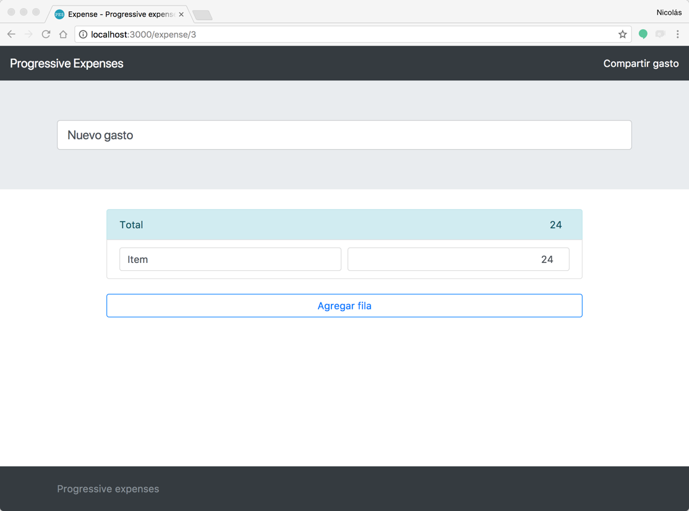

    _Resultado luego de agregar una nueva fila y modificarla_

1. Nuevamente, volver a ver en la consola lo que ocurrió.


    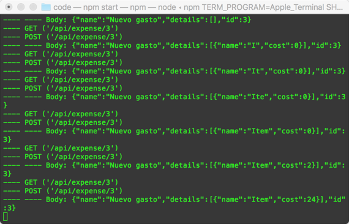

    _Salida del servidor después de agregar y modificar la nueva fila_

1. Ahora, volver a la pantalla inicial haciendo click en el titulo de la aplicación arriba a la izquierda.

    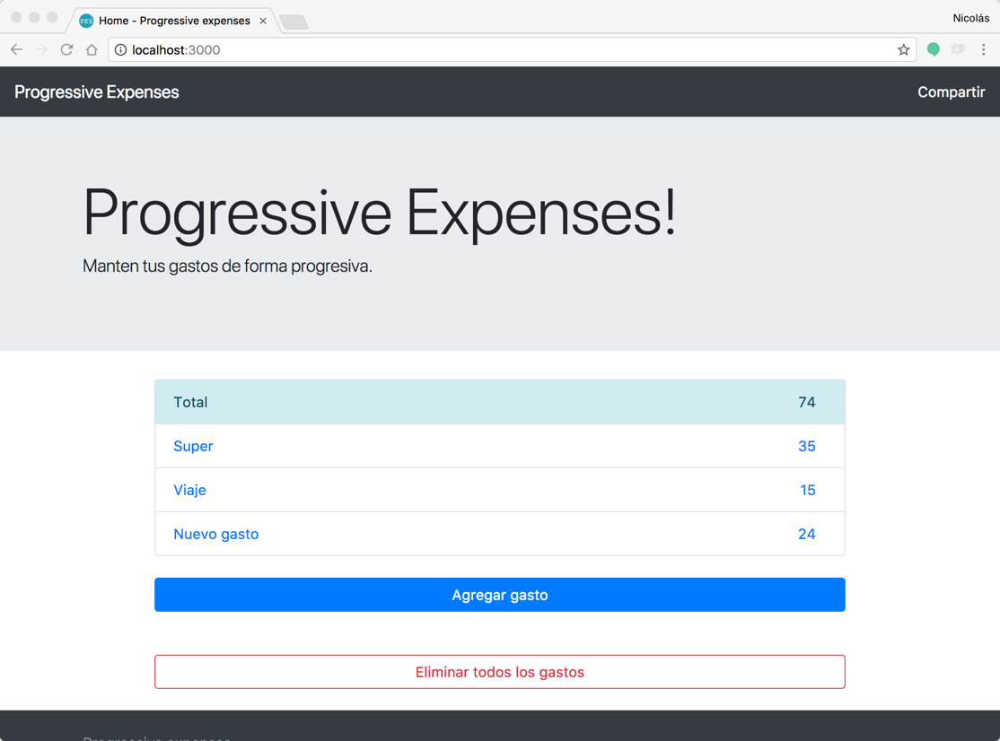

    _Pantalla inicial con los nuevos valores_

1. Probar la funcionalidad de compartir haciendo click en el botón de **Compartir** arriba a la derecha.

    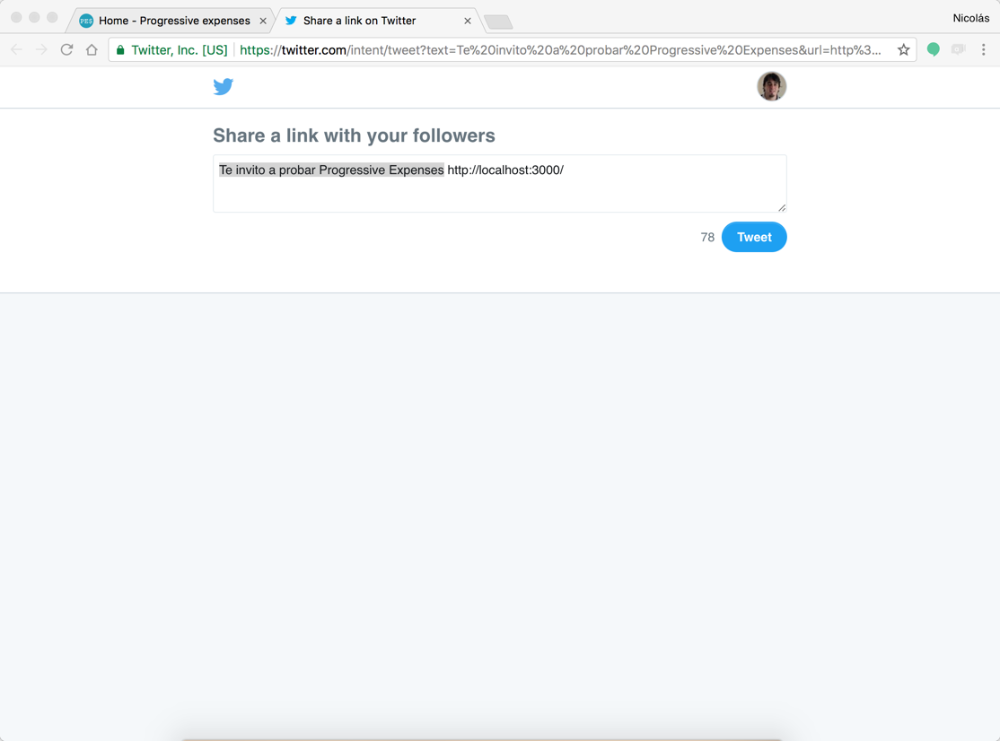

    _Mensaje que aparece cuando se hace click en compartir_

1. Ahora vamos a probar la opción de **Eliminar todos los gastos**, haciendo click en el botón con ese nombre.

    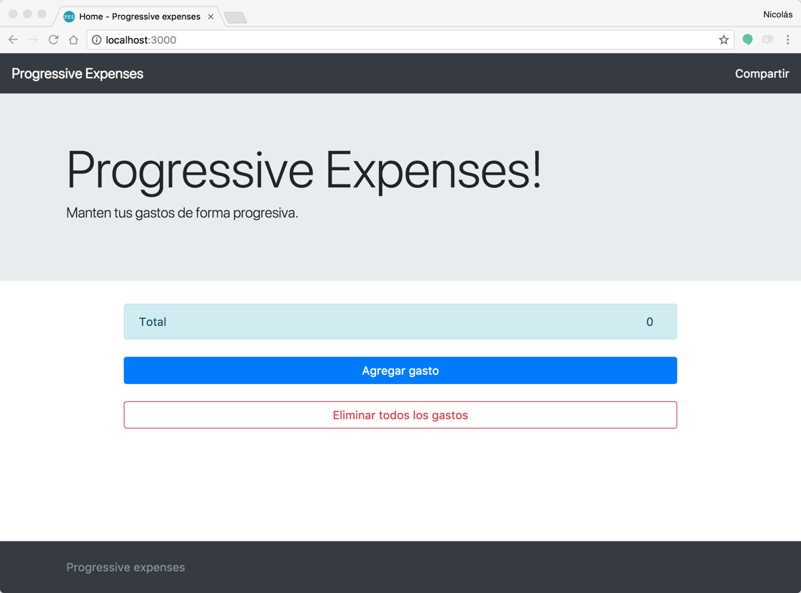

    _Resultado luego de eliminar todos los gastos_

1. Por último, vamos a parar el servidor. Para esto, volver a la consola y parar el proceso con **Control+C**.

1. Refrescar el sitio para ver que no anda. Durante el workshop, vamos a hacer que el sitio siga andando por mas que el servidor no responda.

    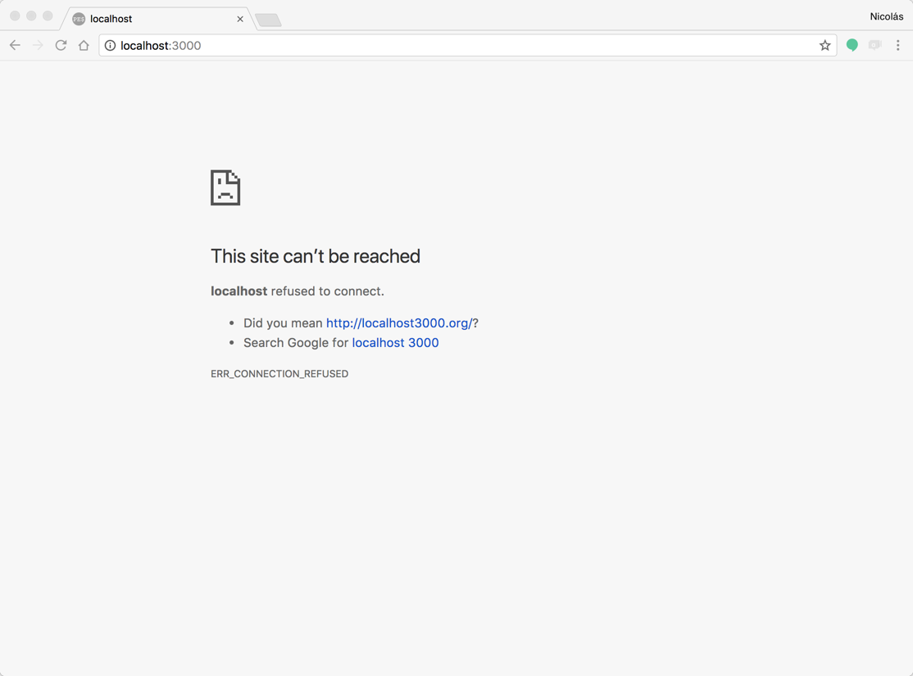

    _Sitio offline_

1. Volver a iniciar el servidor y ver que los datos se reiniciaron, dado que nuestro repositorio no persiste.

    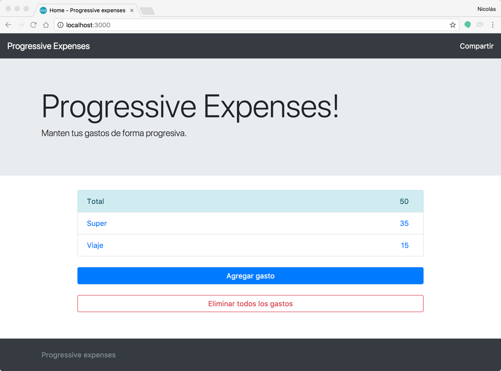

    _Sitio corriendo nuevamente_

1. Parar el servidor.

## Conclusiones

En este módulo exploramos la aplicación que vamos a usar en el transcurso de todo el workshop. Es una aplicación web muy simple pero que nos permite ver las carácteristicas básicas de una progressive web app. Hay que notar que hay varias cosas, como por ejemplo el repositorio de datos en el servidor, que son simplificaciones de una aplicación real para no distraer del real objetivo del workshop.