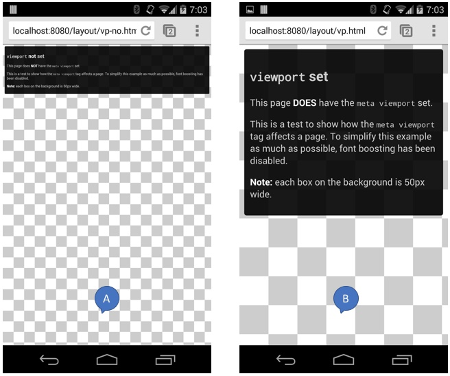

# 3. Conceptos básicos 📜

_Progressive Web App_ no es una sola cosa, es un conjunto de herramientas y buenas prácticas, algunas de ellas ya conocidas hace mucho y otras mucho más nuevas. 

En este módulo veremos algunas de estas herramientas y buenas prácticas que ya existen hace un tiempo, entre ellas algunos conceptos relacionados a lo que normalmente se llama _Responsive design_ y _Progressive enhancement_. 

Para finalizar veremos una checklist para tener a mano a la hora de hacer una _Progressive Web App_.

## Responsive design

<!-- https://developers.google.com/web/fundamentals/design-and-ux/responsive/#responsive-web-design -->

El uso de dispositivos móviles para navegar por Internet está creciendo a un ritmo astronómico, pero desafortunadamente gran parte de la web no está optimizada para ellos. Los dispositivos móviles a menudo están restringidos por el tamaño de la pantalla y requieren un enfoque diferente de cómo se presenta el contenido en la misma.

Una multitud de tamaños de pantalla diferentes existen en los teléfonos, "phablets", tabletas, escritorios, consolas de juegos, televisores e incluso wearables. Los tamaños de la pantalla siempre están cambiando, por lo que es importante que su sitio pueda adaptarse a cualquiera de ellos, hoy o en el futuro.

Responsive diseño web, originalmente definido por [Ethan Marcotte en A List Apart](http://alistapart.com/article/responsive-web-design/), responde a las necesidades de los usuarios y los dispositivos que están utilizando. El diseño cambia según el tamaño y las capacidades del dispositivo. Por ejemplo, en un teléfono los usuarios verían el contenido mostrado en una sola vista de columna; una tableta puede mostrar el mismo contenido en dos columnas.

### Viewport

<!-- https://developers.google.com/web/fundamentals/design-and-ux/responsive/#set-the-viewport -->

Las páginas optimizadas para una variedad de dispositivos deben incluir una etiqueta de meta viewport en la cabecera del documento. Una etiqueta meta viewport le da al navegador instrucciones sobre cómo controlar las dimensiones de la página y la escala.

Para intentar proporcionar la mejor experiencia, los navegadores móviles procesan la página a un ancho de pantalla de escritorio (usualmente alrededor de 980px, aunque esto varía según los dispositivos) y, a continuación, intentan mejorar el aspecto aumentando los tamaños de fuente pantalla. Esto significa que los tamaños de las fuentes pueden parecer inconsistentes para los usuarios, que pueden tener que pulsar dos veces o hacer zoom con gestos para ver e interactuar con el contenido.

En la solución vista en el módulo anterior, podemos encontrar el siguiente meta tag en los dos archivos html (_index.html_ y _expense.html_).

```html
<meta name="viewport" content="width=device-width,initial-scale=1.0,minimum-scale=1.0,maximum-scale=5.0">
```

El uso del valor meta viewport `width=device-width` indica a la página que coincida con el ancho de la pantalla en píxeles independientes del dispositivo. Esto permite que la página refluya contenido para que coincida con diferentes tamaños de pantalla, ya sea renderizado en un teléfono móvil pequeño o en un monitor de escritorio grande.



_La imagen de la izquierda (A) no usa el meta tag viewport mientras que la imagen de la derecha (B) si._

Algunos navegadores mantienen el ancho de la página constante al girar al modo horizontal, y el zoom en lugar de reflujo para llenar la pantalla. La adición del atributo `initial-scale=1` indica a los navegadores que establezcan una relación 1: 1 entre los píxeles CSS y los píxeles independientes del dispositivo independientemente de la orientación del dispositivo, y permite que la página aproveche el ancho total del paisaje.

Por último, los atributos `minimum-scale=1.0` y `maximum-scale=5.0` definen el mínimo y máximo de zoom que se le puede hacer en el sitio. Para mejorar la accesibilidad del sitio se recomienda que el máximo no sea menor a 5 veces, como está puesto en el código de la solución.

> **Nota:** Para garantizar que los navegadores antiguos puedan analizar correctamente los atributos, utilice una coma para separarlos.

### Media queries

<!-- https://developers.google.com/web/fundamentals/design-and-ux/responsive/#css-media-queries -->

Las media queries son simples filtros que se pueden aplicar a estilos CSS. Facilitan el cambio de estilos basándose en las características del dispositivo que procesa el contenido, incluido el tipo de pantalla, el ancho, la altura, la orientación y la resolución.

Por ejemplo, puede colocar todos los estilos necesarios para imprimir dentro de una media queries de impresión:

```html
<link rel="stylesheet" href="print.css" media="print">
```

Además de utilizar el atributo `media` en el tag de stylesheet como se vió en el código anterior, hay otras dos formas de aplicar media queries que se pueden utilizar en un archivo CSS: `@media` y `@import`. Por razones de rendimiento, se recomienda uno de los dos primeros métodos sobre la sintaxis `@import`(consulte [Evitar las importaciones de CSS](https://developers.google.com/web/fundamentals/performance/critical-rendering-path/page-speed-rules-and-recommendations)).

```css
@media print {
  /* print style sheets go here */
}

@import url(print.css) print;
```

La lógica que se aplica a las media queries no es mutuamente excluyente y se aplicará todos los bloques de css donde el criterio de la media query sea válido.

Las media queries nos permiten crear una experiencia de respuesta en la que se aplican estilos específicos a pantallas pequeñas, pantallas grandes y en cualquier otro lugar. La sintaxis de la media query permite la creación de reglas que se pueden aplicar dependiendo de las características del dispositivo.

```css
@media (query) {
  /* Reglas de CSS que van a ser utilizadas cuando la query se cumpla */
}
```

Las consultas más comunes son:

- `min-width`: Reglas aplicadas para cualquier **ancho** de navegador **mayor** que el **valor definido** en la query.
- `max-width`: Reglas aplicadas para cualquier **ancho** de navegador **menor** que el **valor definido** en la query.
- `min-height`: Reglas aplicadas para cualquier **altura** del navegador **mayor** que el **valor definido** en la query.
- `max-height`: Reglas aplicadas para cualquier **altura** del navegador **menor** que el **valor definido** en la query.
- `orientation=portrait`: Reglas aplicadas a cualquier navegador donde la **altura** sea **mayor o igual** que el **ancho**.
- `orientation=landscape`: Reglas para cualquier navegador donde el **ancho** sea **mayor** que la **altura**.

```css
div {
    background-color: red;
}

@media (min-width: 500px) and (max-width: 600px) {
    div {
        background-color: #000;
    }
}
```

En nuestra solución, aprovechamos la librería _Bootstrap_ como se vió anteriormente, que utiliza las media queries para poder tener un diseño que se adapta fácilmente a los diferentes tamaños de pantalla.

### Flexbox

<!-- https://developer.mozilla.org/es/docs/Web/CSS/CSS_Flexible_Box_Layout/Usando_las_cajas_flexibles_CSS -->

La propiedad Flexible Box, o flexbox, de CSS3 es un modo de diseño que permite colocar los elementos de una página para que se comporten de forma predecible cuando el diseño de la página debe acomodarse a diferentes tamaños de pantalla y diferentes dispositivos. Para muchas aplicaciones, el modelo "caja flexible" produce una mejora sobre el modelo "bloque" porque no utiliza la propiedad float, ni hace que los márgenes del contenedor flexible interfieran con los márgenes de sus contenidos.

Muchos diseñadores verán que el modelo "caja flexible" es más sencillo de utilizar. Los elementos "hijos" de una "caja flexible" pueden colocarse en cualquier dirección y pueden tener dimensiones flexibles para adaptarse al espacio visible. Posicionar los elementos "hijos" es por tanto mucho más sencillo, y los diseños complejos pueden hacerse más fácilmente y con código más limpio, ya que el orden de visualización de los elementos es independiente del orden que estos tengan en el código fuente. Esta independencia afecta intencionadamente únicamente a la representación visual, dejando el orden de locución y navegación a lo que diga el código fuente.


## Progressive enhancement

Mejora progresiva (o _Progressive enhancement_) es una estrategia particular de diseño web que acentúa la accesibilidad, código semántico, y tecnologías externas del estilo y el scripting, en una manera adecuada que permite que cada uno tenga acceso al contenido y a la funcionalidad básica de una página web, usando cualquier navegador web o conexión a Internet, mientras que también permite a otros con un mayor ancho de banda o un navegador web más avanzado experimentar una versión mejorada de la página.

Principios:

- Todo el contenido básico debe ser accesible a todos los browsers.
- Toda la funcionalidad básica debe ser accesible a todos los browsers.
- El código semántico contiene todo el contenido.
- Las mejoras en la disposición de los elementos son proporcionadas por el CSS linkeado externamente.
- Las mejoras en el comportamiento son proporcionadas por JavaScript linkeado externamente.
- Las preferencias del browser del usuario final son respetadas.

Un ejemplo simple para ver estos conceptos es el tag `picture` donde, en caso de no tener soporte para este tag, se cuenta con un fallback a uno más soportado como es `img`. A su vez, si el navegador no permite mostrar imágenes o no fue posible acceder a la misma al momento de carga, va a mostrar un texto alternativo gracias al atributo `alt`.

```html
<picture>
  <source media="(min-width: 800px)" srcset="head.webp" type="image/webp">
  <source media="(min-width: 800px)" srcset="head.jpg" type="image/jpeg">
  <source media="(min-width: 450px)" srcset="head-small.webp" type="image/webp">
  <source media="(min-width: 450px)" srcset="head-small.jpg" type="image/jpeg">
  
</picture>
```

_En este ejemplo vemos como en caso de no tener soporte para el formato webp se usa la imagen jpg y en caso de no tener soporte para picture se usa el img._


## Checklist PWA
Para ayudar a los equipos a construir las mejores experiencias posibles, el equipo de web de Google armó la siguiente checklist con todo lo que debe tener una PWA básica, y con todo lo que creen que se debe agregar para lograr una experiencia "ejemplar".

### PWA base

- [x] El sitio se sirve sobre HTTPS.
- [x] Las páginas se adaptan a todas las resoluciones y tamaños de pantalla de dispositivos móviles.
- [x] Todas las URLs cargan sin conexión.
- [x] Se provee Metadata para ser usada al agregar un acceso directo al sitio.
- [x] La primera carga es rápida inclusive en 3G.
- [x] El sitio funciona en todos los navegadores.
- [x] Las transiciones se sienten fluidas.
- [x] Cada página tiene su propia URL.

### PWA ejemplar

#### Indexability & social
- [x] El contenido puede ser indexado por los motores de búsqueda. Intentar que el contenido de la página no dependa de la ejecución de JavaScript del lado del cliente.
- [x] Proveer metadata de [Schema.org](http://schema.org) donde corresponda.
- [x] Proveer metadata Social donde corresponda (tags meta [OpenGraph](http://ogp.me/)).
- [x] Indicar URLs canónicas cuando el contenido esté disponible en múltiples URLs.
- [x] Usar la History API y evitar las URLs con hashes (Evitar urls del tipo: https://example.com/#!user/26601).

#### User experience

- [x] Evitar que el contenido se mueva mientras carga, asegurando que todos los elementos tienen sus tamaños especificados o utilizando placeholders de contenido.
- [x] Asegurar que el botón de atrás mantiene la posición del scroll en la página anterior.
- [x] Evitar que los inputs se oculten cuando se abre el teclado.
- [x] Asegurar que el contenido sea fácil de compartir en modo pantalla completa.
- [x] Asegurar que el contenido se adapta a todos los tamaños de pantalla.
- [x] Interceptar el pedido de agregar un acceso directo usando el evento `beforeinstallprompt` para lanzarlo en el mejor momento para el usuario.


#### Cache

- [x] Intentar, siempre que se pueda, traer datos de cache antes de ir a la red.
- [x] Informar al usuario cuando se encuentra offline.

#### Push notifications

Agregar push notifications no es un requerimiento pero, en caso de hacerlo, seguir los siguientes lineamientos:

- [x] Explicar al usuario cómo y para qué serán utilizadas las notificaciones.
- [x] La UI utilizada para pedir a los usuarios que acepten las notificaciones no debe ser invasiva.
- [x] El sitio opaca todo el contenido mientras pide el permiso para las notificaciones.
- [x] Las notificaciones deben ser oportunas, precisas, relevantes.
- [x] Permitir al usuario activar y desactivar las notificaciones.


Para saber más, [aquí](https://developers.google.com/web/progressive-web-apps/checklist) está la checklist original con explicaciones de cómo probar y corregir cada punto.


## Conclusiones

En este módulo vimos conceptos base a la hora de armar una _Progressive Web App_. Entre ellos _responsive design_, con lo que vimos qué es el _viewport_, las _media queries_ y _flex box_. Aparte de esto vimos el concepto de _progressive enhancement_ y, para finalizar, vimos un checklist para tener en cuenta a la hora de crear una _Progressive Web App_.

## Próximo modulo
Avanzar al [módulo 4 - Appificación de nuestro sitio web 🏠](../04-appification)
