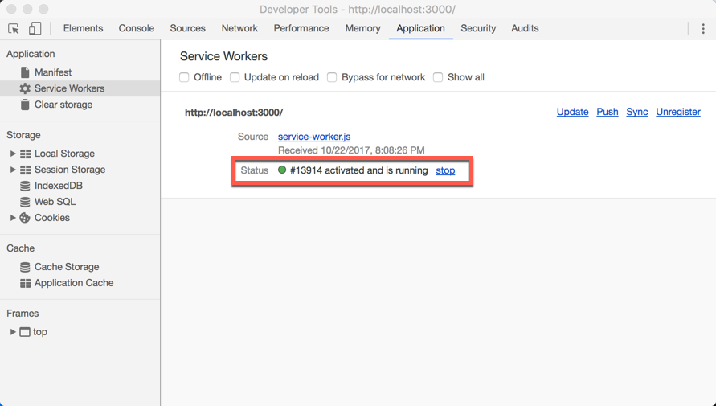
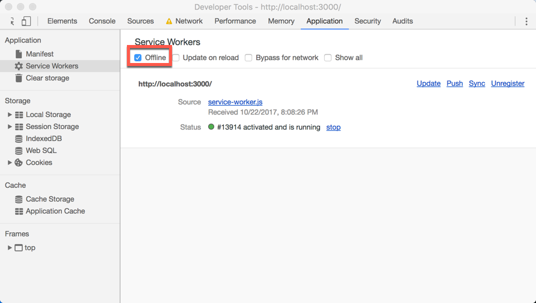
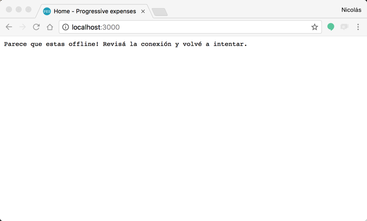
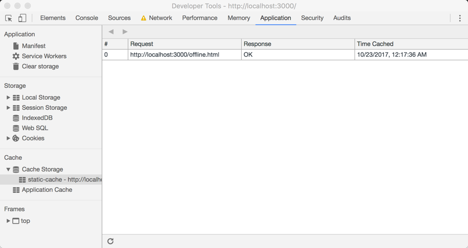
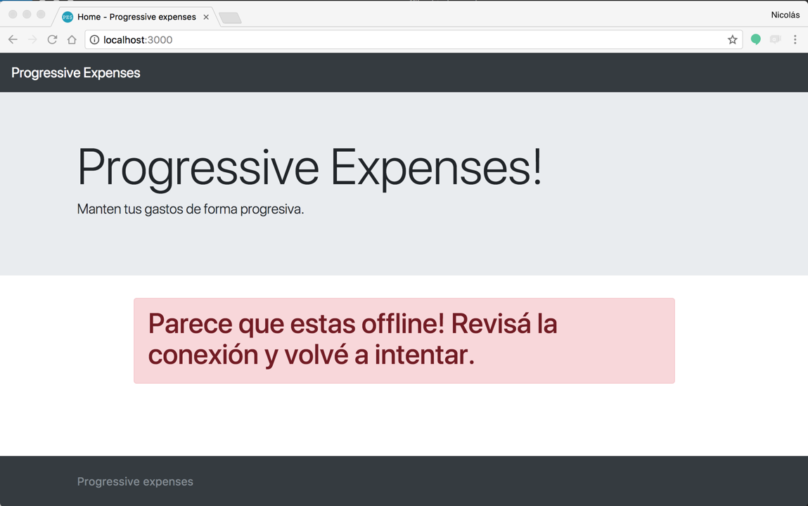
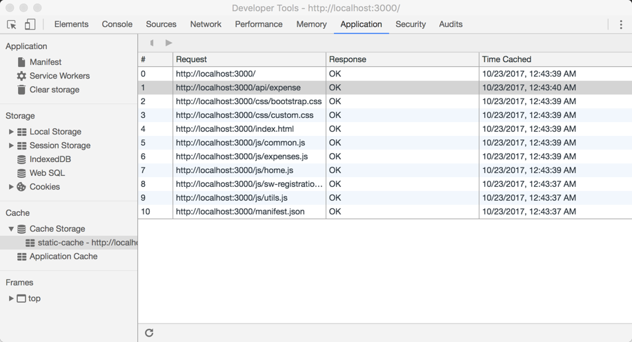
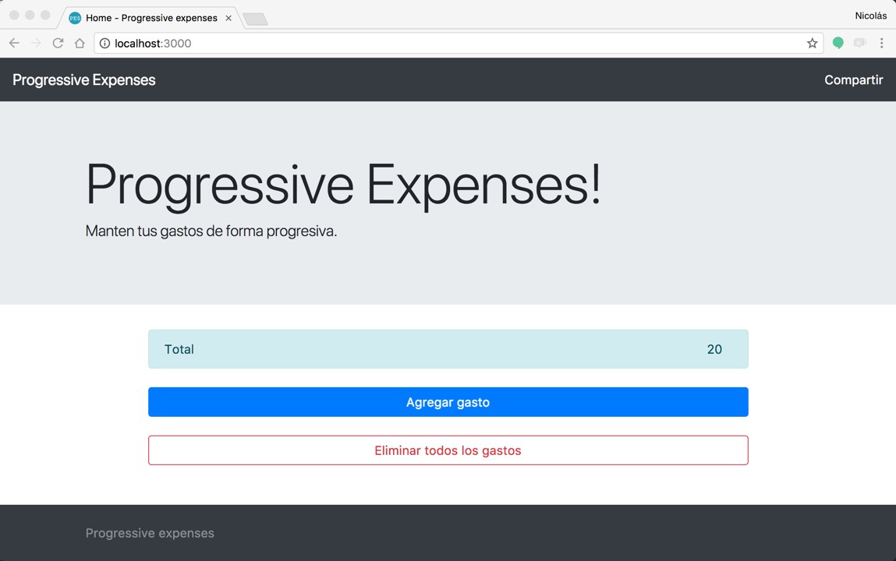

# 5. Soporte offline

Una de las características principales que separa a un sitio web de una aplicación nativa, es la posibilidad de abrir la aplicación por aunque que no tengamos internet. En el caso de las _Progressive Web Apps_ esto podemos hacerlo gracias a un conjunto de herramientas, entre las que se destaca el _service worker_ y la _Cache API_. En este módulo vamos a ver cómo trabajar con estas dos herramientas para agregar soporte offline a nuestra Web App.

## Mostrando un mensaje cuando no hay conexión

El primer paso para mejorar la experiencia de nuestros usuarios es hacerle saber que no tiene conexión por más que está entrando a nuestra PWA. Para esto lo primero que haremos es mostrar un simple mensaje que le avise que no tiene la experiencia completa de nuestra web app porque no tiene acceso a internet.

1. Abrir una terminal en la carpeta en donde tengas el código. Si todavía no copiaste el código o no hiciste el módulo anterior, copiar la carpeta **code** localizada dentro de ese módulo a algún lugar cómodo para poder trabajar (ejemplo: el escritorio o la carpeta de usuario).

1. Abrir el archivo `service-worker.js` y actualizar el event listener de _fetch_ con la siguiente implementación.

    ```js
    self.addEventListener('fetch', function(event) {
        console.log('On fetch');
        console.log(event.request);

        if (event.request.method != 'GET') return;

        event.respondWith(
            fetch(event.request).catch(() => {
                return new Response('Parece que estas offline! Revisá la conexión y volvé a intentar.');
            })
        );
    });
    ```

    > **Nota**: Lo que estamos haciendo en este código, es agregar la llamada al método `catch` de la promise que devuelve `fetch` y devolviendo en la misma una nueva respuesta con el mensaje que queremos mostrar.
    > Con esta técnica, ante un error en el pedido, podemos hacer alguna operación. En nuestro caso estamos creando una nueva respuesta, pasando el texto que queremos mostrar, pero podríamos hacer operaciones más complejas como haremos más adelante.

1. Iniciar el servidor con `npm start` y navegar en el browser a [http://localhost:3000](http://localhost:3000).

1. Abrir las _Developer Tools_ del browser, seleccionar la solapa **Application** y ver la información que figura en la misma dentro de la categoría **Service Worker**. Asegurarse que figure como _Activated and is running_ (refrescar el sitio en caso contrario).

    

    _Estado del service worker en las developer tools_

1. En la misma ventana de las _Developer Tools_, pasar a modo offline seleccionando la opción _offline_.

    

    _Cambiando a offline con las developer tools_

1. Refrescar el sitio y comprobar que se muestra el mensaje dado que no tiene acceso a internet.

    

    _Mensaje en modo offline_

1. Volver al modo online y refrescar el sitio para comprobar que ande todo como antes.

## Mostrando un html offline con Cache API

El siguiente paso para mejorar la experiencia de nuestros usuarios es poder mostrarle una página que básicamente diga el mismo mensaje, pero tenga el mismo estilo que nuestro sitio. Para esto vamos a utilizar la _Cache API_ que nos permitirá guardar las respuestas a requests localmente. Esto implica que podemos pedir los archivos que requerimos en esos casos y guardarlos localmente para tenerlos listos ante una eventualidad.

La _Cache API_ proporciona un mecanismo de almacenamiento para pares de objetos _Request/Response_ que se almacenan en caché, por ejemplo, como parte del ciclo de vida de un _Service Worker_. Es importante tener en cuenta que la _Cache API_ está expuesta tanto en `window` como en los workers, por lo que no hace falta usarla únicamente en un _Service Worker_.

Para un mismo origen, pueden existir múltiples objectos de cache con diferentes nombres. El desarrollador es el responsable de implementar como se manejan las actualizaciones de la Cache, esto es porque los elementos dentro de la caché no se actualizan, como tampoco caducan, a menos que se solicite explícitamente. Es por esto que también es responsable de purgar periódicamente las entradas de caché. 

Cada navegador tiene un límite estricto en la cantidad de almacenamiento en caché que puede usar un origen determinado. Las estimaciones de uso de la cuota de caché están disponibles a través de la _StorageEstimateAPI_. El navegador hace todo lo posible para administrar el espacio en disco, pero puede eliminar el almacenamiento en caché para un origen. En caso de no tener memoria, el navegador generalmente eliminará todos los datos de un origen.

1. Abrir el archivo `service-worker.js` y agregar las siguientes constantes al inicio del archivo.

    ```js
    (function() {
        'use strict';

        const CACHE_NAME = 'static-cache';
        const urlsToCache = [
            'offline.html'
        ];

        //...
    ```


1. Ahora, actualizar el handler del evento `install` con el siguiente código para iniciar la cache con el nombre definido en la constante `CACHE_NAME` y agregar las urls definidas en constante `urlsToCache`.

    ```js
    self.addEventListener('install', (event) => {
        event.waitUntil(
            caches.open(CACHE_NAME)
                .then(function(cache) {
                    return cache.addAll(urlsToCache);
                })
        );
    });
    ```

    > **Nota**: En este código estamos usando el event listener del evento `install` del service worker visto en el módulo anterior. Este evento se ejecuta la primera vez que corre el service worker, que es un escenario donde tiene internet. Luego, usamos el método `waitUntil` que bloquea hasta que termine de procesar la función pasada por parámetro. Esta función abre el caché y luego agrega todas las urls que le pasamos en `urlsToCache`. En nuestro caso es solo el archivo `offline.html`.

1. Luego, actualizaremos el event listener de `fetch` para que muestre el archivo de `offline.html` desde la caché en vez de devolver el mensaje como antes. Para esto, actualizar la implementación con la siguiente versión.

    ```js
    self.addEventListener('fetch', function(event) {
        console.log('On fetch');
        console.log(event.request);

        if (event.request.method != 'GET') return;

        event.respondWith(
            fetch(event.request).catch(() => {
                return caches.match('/offline.html');
            })
        );
    });
    ```

    > **Nota**: En este código estamos reemplazando la creación de una respuesta por la búsqueda en el caché de la página `offline.html` mediante el método `match`.

1. Por último, agregar el archivo `offline.html` que se encuentra en la carpeta `assets` de este módulo a la carpeta `public`.

1. Nuevamente navegar en el browser a [http://localhost:3000](http://localhost:3000) (iniciar el servidor con `npm start` si es que se lo detuvo antes).

1. Abrir las _Developer Tools_ del browser, seleccionar la solapa **Application** y ver la información que figura en la misma dentro de la categoría **Service Worker**. Asegurarse que figure como _Activated and is running_ (refrescar el sitio en caso contrario).

    

    _Estado del service worker en las developer tools_

1. En la misma ventana de las _Developer Tools_, ir a la categoría **Cache Storage** y expandirla para ver la entrada correspondiente a `static-cache` que estamos agregando en el evento `install` así como también la entrada a offline.

    

    _Viendo la cache en las developer tools_

    > **Nota**: Si no se ven cambios, deshabilitar el modo offline y refrescar el sitio. Se puede forzar a que se refresque el service worker con la opción `Update on reload`.

1. Volver a la categoría **Service Worker** y pasar a modo offline seleccionando la opción _offline_.

    

    _Cambiando a offline con las developer tools_

1. Refrescar el sitio y comprobar que se muestra la página `offline.html` en vez del mensaje que se mostraba anteriormente.

    

    _Página offline.html en modo offline_

1. Volver al modo online y refrescar el sitio para comprobar que ande todo como antes.

1. Antes de terminar esta tarea, hay que tener en cuenta que tenemos que limpiar la caché de los elementos que ya no necesitamos, para eso vamos a usar el evento `activate`, reemplazando la implementación con la siguiente que eliminará todas las entradas que no coincidan.

    ```js
    self.addEventListener('activate', event => {
        var keepList = [CACHE_NAME];
    
        event.waitUntil(
            caches.keys().then(cacheNameList => {
                return Promise.all(cacheNameList.map(cacheName => { 
                    if (keepList.indexOf(cacheName) === -1) {
                        return caches.delete(cacheName);
                    }
                }));
            })
        );
    });
    ```

    > **Nota**: Se puede volver a probar que todo siga andando como corresponde e incluso cambiar el nombre de la caché cambiando el valor de `CACHE_NAME` viendo que cuando se active se borra la caché anterior.


## Sitio completo de forma offline

Lo que nos falta para tener la mejor experiencia de usuario y que no parezca un sitio web sino una aplicación, es poder acceder a todo el contenido de forma offline. Para esto vamos a tener que optar por una nueva estrategia de caching, apuntando a tener todo el contenido almacenado una vez que se haya accedido al mismo al menos una vez.

A la hora de implementar estrategias de caching, tenemos múltiples opciones que dependen de las características de nuestro sitio y su contenido. En este caso implementaremos una estrategia simple de cache first, haciendo que primero se busque en el cache y luego, en caso de no encontrarse, se realice el request al servidor guardando el resultado en la cache.

1. Abrir el archivo `service-worker.js` y actualizar la constantes `urlsToCache` al inicio del archivo, con el siguiente contenido.

    ```js
    const urlsToCache = [
        '.',
        'index.html',
        'css/bootstrap.css',
        'css/custom.css',
        'js/common.js',
        'js/expenses.js',
        'js/home.js'
    ];
    ```

1. Ahora, agregamos la siguiente función después de los event listeners. Con esta función se realizará el fetch de los archivos y luego, si no hubo error, se pasará a guardar la respuesta en el cache antes de devolverla.

    ```js
    function fetchAndCache(url) {
        return fetch(url)
            .then((response) => {
                // Check if we received a valid response
                if (!response.ok) {
                    throw Error(response.statusText);
                }
                return caches.open(CACHE_NAME)
                    .then((cache) => {
                        cache.put(url, response.clone());
                        return response;
                    });
            })
            .catch((error) => {
                console.log('Request failed:', error);
                // You could return a custom offline 404 page here
            });
    }
    ```

1. Luego, actualizaremos el handler del evento _fetch_ con la siguiente implementación. Esta implementación que buscará primero en el cache y luego, en caso de no encontrar la respuesta, hará el pedido y actualizará el cache local.

    ```js
    self.addEventListener('fetch', event => {
        console.log(event.request.url);

        if (event.request.method !== "GET") return;

        if (event.request.url.indexOf('/api/') !== -1) {
            event.respondWith(fetchAndCache(event.request));
        } else {
            event.respondWith(
                caches.match(event.request).then(response => {
                    return response || fetchAndCache(event.request);
                })
            );
        }
    });
    ```

    > **Nota**: Solo vamos a cachear request de tipo `GET`, no podemos almacenar en cache request con otro método.
    >
    > Por otro lado, en el `if`, estamos viendo evitando buscar en cache las llamadas a la API (`event.request.url.indexOf('/api/') !== -1`) dado que, al usar este tipo de estrategia, nunca podremos tener los valores actuales sino que siempre se traerán los cacheados. Esto es importante para tener en cuenta a la hora de decidir qué estrategia de caching vamos a utilizar. En este caso, solo estamos guardando los resultados de las llamadas a la api en la caché, pero todavía no los estamos consumiendo.

1. Nuevamente navegar en el browser a [http://localhost:3000](http://localhost:3000) (iniciar el servidor con `npm start` si es que se lo detuvo antes).

1. Abrir las _Developer Tools_ del browser, seleccionar la solapa **Application** y ver la información que figura en la misma dentro de la categoría **Service Worker**. Asegurarse que figure como _Activated and is running_ (refrescar el sitio en caso contrario).

    

    _Estado del service worker en las developer tools_

1. En la misma ventana de las _Developer Tools_, ir a la categoría **Cache Storage** y expandirla para ver la entrada correspondiente a `static-cache` que estamos agregando en el evento `install` así como también la entrada a offline.

    

    _Viendo la cache en las developer tools_

    > **Nota**: Si no se ven cambios, deshabilitar el modo offline y refrescar el sitio. Se puede forzar a que se refresque el service worker con la opción `Update on reload`.

1. Volver a la categoría **Service Worker** y pasar a modo offline seleccionando la opción _offline_.

    

    _Cambiando a offline con las developer tools_

1. Refrescar el sitio y comprobar que se muestra el sitio entero pero no los datos.

    

    _Modo offline sin datos_

1. Volver al modo online y refrescar el sitio para comprobar que ande todo como antes.

1. Solo falta traer los datos relacionados a las llamadas de tipo GET de las APIs de la caché cuando no haya conexión. Para esto, abrir el archivo `common.js` dentro de la carpeta `public/js` y actualizar las funciones `getExpenses` y `getExpense`, agregando un catch a la llamada de `apiClient` donde buscamos en el cache el valor en caso de error del fetch.

    ```js
    function getExpenses(cb) {
        apiClient(`${serverUrl}api/expense`)
            .catch(() => caches.match(`${serverUrl}api/expense`))
            .then(response => response.json())
            .then(cb);
    }

    function getExpense(expenseId, cb) {
        apiClient(`${serverUrl}api/expense/${expenseId}`)
            .catch(() => caches.match(`${serverUrl}api/expense/${expenseId}`))
            .then(response => response.json())
            .then(cb);
    }
    ```

    > **Nota**: Estamos agregando solo el catch de la promise que devuelve fetch y buscando en la cache la url que se pidió (`.catch(() => caches.match(url));`). Si se cacheó se va a poder tener información para mostrar, caso contrario va a fallar como antes.

1. Volver a probar el sitio en modo offline para comprobar que podemos acceder a los datos si es que alguna vez accedimos.

    > **Nota**: Para una experiencia ideal, deberíamos manejar algunos otros escenarios como el de las páginas de detalle y deshabilitar los botones para agregar items dentro del catch que agregamos en el paso anterior.

## Conclusiones

En este módulo vimos cómo trabajar con el _service worker_, los eventos de `install`, `activate` y `fetch`, en conjunto con la _Cache API_ para tener soporte offline de nuestra web app, dando una mejor experiencia a nuestros usuarios.

## Próximo modulo

Avanzar al [módulo 6](../06-share)
