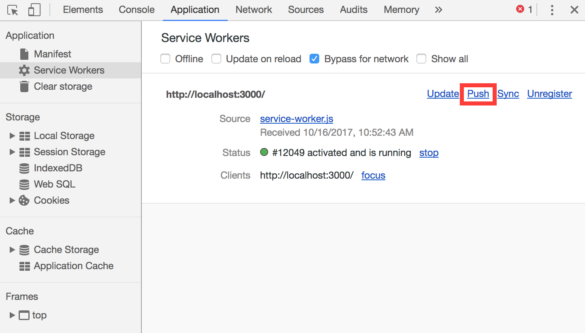

# 7. Trabajando con notificaciones

En esta sección vamos a recorrer los pasos necesarios para enviar, recibir y mostrar notificaciones push.

En primer lugar debemos distinguir las notificaciones de las notificaciones push.

- Las notificaciones son mensajes que son mostrados en el dispositivo del usuario, fuera del contexto del navegador o una aplicación.

- Las notificaciones push son notificaciones creadas como respuesta a un mesaje enviado desde un servidor y que funcionan inclusive cuando el usuario no está usando activamente nuestra aplicación.

El sistema de notificaciones en chrome está construído encima de la API de Service Worker, que recibe los mensajes push en segundo plano y los transmite a nuestra aplicación.


## Lo que vamos a hacer

- Crear y mostrar una notificación en una aplicación web.
- Aprender a usar la API de Web Push para recibir una notificación push.


## Lo que no vamos a hacer

- Implementar el envío de una notificación desde un servidor propio. (Lo vamos a simular para evitar todo el código de backend)


## Implementar una notificación

Vamos a mostrar una notificación cuando se haya guardado un nuevo gasto.

1. Abrir el archivo `common.js` y agregar la siguiente función:

    ```js
    let swRegistration;

    function displayNotification(title, body) {
        if ('serviceWorker' in navigator && 'PushManager' in window) {
            navigator.serviceWorker.getRegistration().then(function(reg) {
               swRegistration = reg;
               swRegistration.pushManager.getSubscription()
                   .then(function (subscription) {
                        if (Notification.permission === 'granted') {
                           createNotification(title, body);
                        } else {
                           if (Notification.permission !== 'denied') {
                               subscribeUser().then(function (subscription) {
                                   if (Notification.permission === "granted") {
                                       createNotification(title, body);
                                   }
                               })
                           }
                        }
                   });
            });
        }
    }
    ```
    
    La función `displayNotification` es la que será invocada al crear el nuevo gasto, dentro de ella lo que hacemos es:
    
    - Obtener la registración del service worker y guardarla para un posterior uso.
    - Revisar el permiso para mostrar notificaciones:
        - Si tenemos permiso, mostramos la notificación.
        - Si no:
            - Si ya nos denegaron el permiso, no hacemos nada.
            - De lo contrario, probablemente el usuario nunca haya contestado al respecto
             entonces le pedimos el permiso y, si acepta, le mostramos la notificación.
             
    > **Nota:** Lo primero que hacemos es verificar que el dispositivo sea compatible. En caso contrario la función no tiene efecto.


2. Agregar al mismo archivo la función que crea la notificación:

    ```js
    function createNotification(title, body) {
        const options = {
            body: body,
            icon: 'img/logo-512.png',
            vibrate: [100, 50, 100]
        };
        swRegistration.showNotification(title, options);
    }
    ``` 

    Lo que hacemos acá es mostrar la notificación a través del service worker.
    
    Podríamos hacerlo directamente con la api de notificaciones haciendo: `new Notification("Esto es una notificación", options)`.
    Pero eso nos limita la cantidad de opciones que podemos utilizar.
    
    > **Nota**: Las notificaciones tienen una gran cantidad de opciones de configuración:
    > - Opciones visuales:
    >   - **body**: Contenido de la notificación que se ve debajo del título. 
    >   - **icon**: URL de la imagen para ser usada como ícono. 
    >   - **image**: URL de una imagen para ser mostrada en la notificación.
    >   - **badge**: URL de la imagen para ser mostrada en caso de no haber lugar suficiente para mostrar la notificación en sí.
    >   - **vibrate**: [Patrón de vibración](https://developer.mozilla.org/en-US/docs/Web/API/Vibration_API#Vibration_patterns) para reproducir con la notificación. 
    >   - **sound**: URL del audio a reproducir.
    >   - **dir**: Dirección del texto. Por defecto es `auto` que lo ajusta al idioma seleccionado en el browser. La mayoría de los navegadores ignoran esta opción.
    > - Opciones de comportamiento:
    >   - **tag**: String que sirve para identificar notificaciones relacionadas y reemplazarlas unas por otras más nuevas. Evitando la generación de múltiples notificaciones.
    >   - **data**: Data que se quiere enviar en la notificación para ser usada al recibirla.
    >   - **requireInteraction**: Indica que la notificación debe permanecer activa hasta que el usuario la clickea o la cancela, en lugar de ocultarse automáticamente. Por defecto es `false`.
    >   - **noscreen**: Un Boolean indicando si la notificación debe encencer o no la pantalla del usuario. Por defecto es `false`.
    >   - **silent**: Un Boolean indicando si la notificación debe ser silenciosa (sin sonido ni vibración). Por defecto es `false` (no sileciosa).
    >   - **sticky**: Un Boolean indicando si la notificación debe ser 'sticky' (no fácilmente eliminable). Por defecto es `false`.
    > - Opciones visuales y de comportamiento
    >   - **actions**: Un array de NotificationActions formadas por `action`, `title` y `icon` y que representan las acciones que pueden ser tomadas desde la notificación misma. El nombre de la acción elegida se envía al Service Worker para permitir tomar la acción correspondiente.
    > - Opciones informativas sin efectos visuales:
    >   - **timestamp**: Puede representar la fecha de creación o una fecha arbitraria que se quiera asociar con la notificación.
        

3. Abrir el archivo `home.js` y modificar el event listener del click en el botón de agregar para que muestre la notificación luego de actualizar la vista:

    ```js
    addBtn.addEventListener('mousedown', () => {
        const newExpense = createNewExpense();
        saveExpense(newExpense, () => {
            updateHomeView();
            displayNotification("Nuevo gasto!", "Tu nuevo gasto fue guardado con éxito!");
        });
    });
    ```

4. Generar las keys necesarias para identificar nuestro servidor:

    Para Chrome, una opción es crear una cuenta de [Firebase](https://firebase.google.com/). Si queremos evitar ese paso podemos utilizar [VAPID](https://blog.mozilla.org/services/2016/04/04/using-vapid-with-webpush/).
    Para esto, debemos ejecutar los siguientes comandos:
    - `npm i -g web-push`
    - `web-push generate-vapid-keys [--json]`
    
    Guardar el valor de la Public Key para el próximo paso.

5. Suscribir al usuario.
    
    Previamente usamos la función que hace la suscripción pero no la implementamos. Esa función es la que sigue a continuación.
    
    Debemos reemplazar el valor de la constante `VAPID_VALID_PUBLIC_KEY` por el generado en el paso anterior y agregar este código al archivo `common.js`.

    ```js
    const VAPID_VALID_PUBLIC_KEY = "Reemplazar por la public key del paso anterior";
    function subscribeUser() {
        return swRegistration.pushManager.subscribe({
            userVisibleOnly: true,
            applicationServerKey: urlB64ToUint8Array(VAPID_VALID_PUBLIC_KEY)
        })
    }
    ```
    
    > **Nota**: La función `urlB64ToUint8Array` ya está implementada e incluida en el archivo `utils.js`.

6. Probar.

    Haciendo click en el botón "Agregar gasto" ya deberíamos poder ver la notificación.
    
    Si esto no fuera así, revisar todos los pasos antes de seguir con la siguiente sección.


## Recibir una notificación push
Ahora que ya manejamos los permisos y podemos mostrar notificaciones, vamos a simular la llegada de una notificación push.

Para esto debemos hacer que nuestro service worker sepa reaccionar a los mensajes push que pueden llegar en cualquier momento. Inclusive cuando el usuario no esté visitando nuestro sitio.


### Reaccionar a la llegada de la push

Imaginemos la siguiente situación:
> Nuestra app es colaborativa y queremos que, al cargar un nuevo gasto, se envíe una notificación a todos los usuarios de ese grupo.

En nuestro `service-worker.js` debemos suscribirnos a un nuevo evento, el de `push`.

Allí, lo que haremos es mostrar una notificación similar a las anteriores, con 2 acciones y algo de data cada vez que un amigo agregue un nuevo gasto.

```js
self.addEventListener('push', function(e) {

    const options = {
        body: 'Revisa el nuevo gasto del viaje',
        icon: 'img/logo-512.png',
        vibrate: [100, 50, 100],
        data: {
            primaryKey: 2
        },
        actions: [
            {action: 'explore', title: 'Ir al sitio',
                icon: 'img/check.png'},
            {action: 'close', title: 'Cerrar la notificación',
                icon: 'img/xmark.png'}
        ]
    };

    e.waitUntil(
        self.registration.showNotification('Push Notification', options)
    );
});
```


### Reaccionar a las acciones de la notificación
Cuando llegue al notificación y hagamos click en ella, dependiendo de la acción elegida, lo que querremos será cerrarla o ir al sitio a ver el gasto en cuestión.

Para eso, nos valemos de la data donde recibiremos el id de la notificación y podemos abrir una nueva ventana llevando a la url correspondiente.

```js
self.addEventListener('notificationclick', function(e) {
    const notification = e.notification;
    const action = e.action;

    if (action === 'close') {
        notification.close();
    } else if (notification.data) {
        const primaryKey = notification.data.primaryKey;
        clients.openWindow('expense/' + primaryKey);
        notification.close();
    }
});
```

### A probarlo!

Para simular la llegada de la push hacer:

    - Botón derecho.
    - Inspect.
    - Elegir la sección Application o Aplicación.
    - En el menú izquierdo: Service Workers.
    - Y hacer click en Push.


_Simular llegada de push desde las dev tools de chrome._

Si todo salió bien, deberíamos ver la notificación y al clickear sobre ella, se debería abrir una nueva ventana mostrando los gastos del viaje.
    

## Extras

Si te interesa profundizar más, te dejamos algunas ideas para agregar:

- Implementar el envío de las notificaciones desde nuestro servidor node. Para esto, te recomendamos revisar el paquete de npm [web-push](https://www.npmjs.com/package/web-push) que implementa el protocolo de web push y es compatible también con otras tecnologías anteriores.
- Usar el atributo tag de las notificaciones para reemplazar una por otra más nueva sin haber leído ni cancelado la primera.


## Próximo modulo
Avanzar al [módulo 8](../08-background)