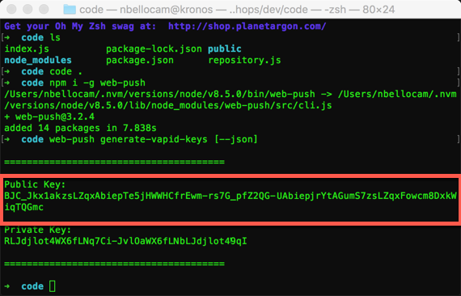
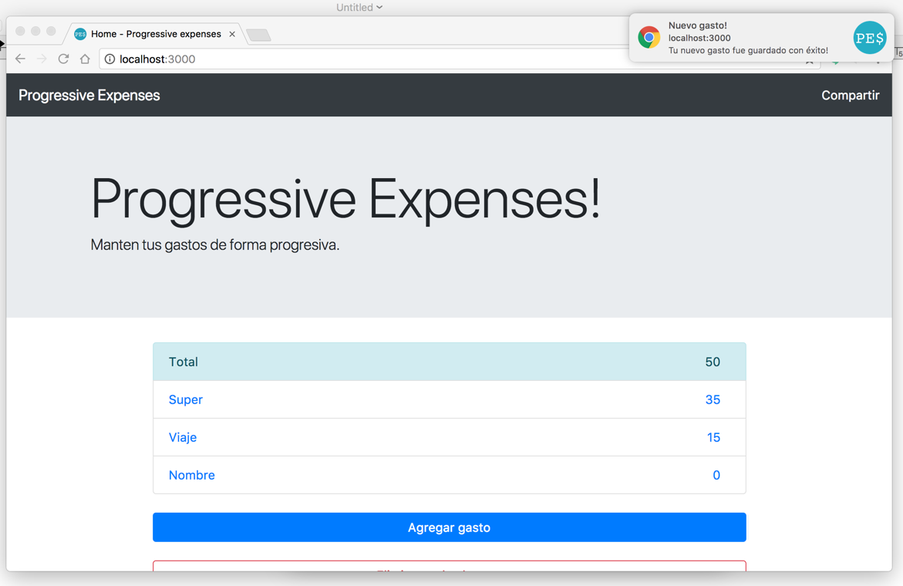
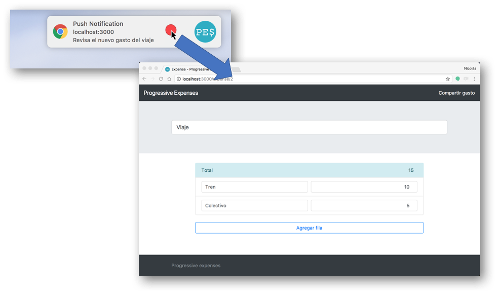

# 7. Trabajando con notificaciones 🔔

En este módulo vamos a recorrer los pasos necesarios para enviar, recibir y mostrar _notificaciones push_.

En primer lugar debemos distinguir las _notificaciones_ de las _notificaciones push_.

- Las _notificaciones_ son mensajes que son mostrados en el dispositivo del usuario, fuera del contexto del navegador o una aplicación.

- Las _notificaciones push_ son notificaciones creadas como respuesta a un mesaje enviado desde un servidor y que funcionan inclusive cuando el usuario no está usando activamente nuestra aplicación.

El sistema de notificaciones en chrome está construído encima de la API de _Service Worker_, que recibe los mensajes push en segundo plano y los transmite a nuestra aplicación.


## Lo que vamos a hacer

- Crear y mostrar una notificación en una aplicación web.
- Aprender a usar la API de Web Push para recibir una notificación push.


## Lo que **NO** vamos a hacer

- Implementar el envío de una notificación desde un servidor propio. (Lo vamos a simular para evitar todo el código de backend que no es parte del objetivo de este workshop)


## Implementar una notificación

Vamos a mostrar una notificación cuando se haya guardado un nuevo gasto.

1. Abrir una terminal en la carpeta en donde tengas el código. Si todavía no copiaste el código o no hiciste el módulo anterior, copiar la carpeta **code** localizada dentro de ese módulo a algún lugar cómodo para poder trabajar (ejemplo: el escritorio o la carpeta de usuario).

1. Abrir el archivo `common.js` y agregar la siguiente función.

    ```js
    let swRegistration;

    function displayNotification(title, body) {
        if ('serviceWorker' in navigator && 'PushManager' in window) {
            navigator.serviceWorker.getRegistration().then(function(reg) {
               swRegistration = reg;
               swRegistration.pushManager.getSubscription()
                   .then(function (subscription) {
                        if (Notification.permission === 'granted') {
                           createNotification(title, body);
                        } else {
                           if (Notification.permission !== 'denied') {
                               subscribeUser().then(function (subscription) {
                                   if (Notification.permission === "granted") {
                                       createNotification(title, body);
                                   }
                               })
                           }
                        }
                   });
            });
        }
    }
    ```
    
    La función `displayNotification` es la que será invocada al crear el nuevo gasto, dentro de ella lo que hacemos es:
    
    - Obtener la registración del service worker (con la función `getRegistration`) y guardarla para un posterior uso.
    - Revisar el permiso para mostrar notificaciones (con `Notification.permission`):
        - Si tenemos permiso, mostramos la notificación.
        - Si no:
            - Si ya nos denegaron el permiso, no hacemos nada.
            - De lo contrario, probablemente el usuario nunca haya contestado al respecto
             entonces le pedimos el permiso y, si acepta, le mostramos la notificación.
             
    > **Nota:** Lo primero que hacemos es verificar que el dispositivo sea compatible. En caso contrario, la función no tiene efecto. Para esto, se usan las validaciones `'serviceWorker' in navigator && 'PushManager' in window`.

1. Agregar al mismo archivo la función que crea la notificación.

    ```js
    function createNotification(title, body) {
        const options = {
            body: body,
            icon: 'img/logo-512.png',
            vibrate: [100, 50, 100]
        };

        swRegistration.showNotification(title, options);
    }
    ``` 

    Lo que hacemos acá es mostrar la notificación a través del service worker (por eso se usa `swRegistration.showNotification(title, options);`, siendo la variable `swRegistration` el registro del service worker que obtuvimos en el punto anterior). Podríamos hacerlo directamente con la api de notificaciones haciendo: `new Notification("Esto es una notificación", options)`, pero eso nos limita la cantidad de opciones que podemos utilizar.
    
    > **Nota**: Las notificaciones tienen una gran cantidad de opciones de configuración:
    > - Opciones visuales:
    >   - **body**: Contenido de la notificación que se ve debajo del título. 
    >   - **icon**: URL de la imagen para ser usada como ícono. 
    >   - **image**: URL de una imagen para ser mostrada en la notificación.
    >   - **badge**: URL de la imagen para ser mostrada en caso de no haber lugar suficiente para mostrar la notificación en sí.
    >   - **vibrate**: [Patrón de vibración](https://developer.mozilla.org/en-US/docs/Web/API/Vibration_API#Vibration_patterns) para reproducir con la notificación. 
    >   - **sound**: URL del audio a reproducir.
    >   - **dir**: Dirección del texto. Por defecto es `auto` que lo ajusta al idioma seleccionado en el browser. La mayoría de los navegadores ignoran esta opción.
    > - Opciones de comportamiento:
    >   - **tag**: String que sirve para identificar notificaciones relacionadas y reemplazarlas unas por otras más nuevas. Evitando la generación de múltiples notificaciones.
    >   - **data**: Data que se quiere enviar en la notificación para ser usada al recibirla.
    >   - **requireInteraction**: Indica que la notificación debe permanecer activa hasta que el usuario la clickea o la cancela, en lugar de ocultarse automáticamente. Por defecto es `false`.
    >   - **noscreen**: Un Boolean indicando si la notificación debe encencer o no la pantalla del usuario. Por defecto es `false`.
    >   - **silent**: Un Boolean indicando si la notificación debe ser silenciosa (sin sonido ni vibración). Por defecto es `false` (no sileciosa).
    >   - **sticky**: Un Boolean indicando si la notificación debe ser 'sticky' (no fácilmente eliminable). Por defecto es `false`.
    > - Opciones visuales y de comportamiento
    >   - **actions**: Un array de NotificationActions formadas por `action`, `title` y `icon` y que representan las acciones que pueden ser tomadas desde la notificación misma. El nombre de la acción elegida se envía al Service Worker para permitir tomar la acción correspondiente.
    > - Opciones informativas sin efectos visuales:
    >   - **timestamp**: Puede representar la fecha de creación o una fecha arbitraria que se quiera asociar con la notificación.
        

1. Abrir el archivo `home.js` y modificar el event listener del click en el botón de agregar para que muestre la notificación luego de actualizar la vista.

    ```js
    addBtn.addEventListener('mousedown', () => {
        const newExpense = createNewExpense();
        saveExpense(newExpense, () => {
            updateHomeView();
            displayNotification("Nuevo gasto!", "Tu nuevo gasto fue guardado con éxito!");
        });
    });
    ```

1. Generar las keys necesarias para identificar nuestro servidor. Para Chrome, una opción es crear una cuenta de [Firebase](https://firebase.google.com/). Si queremos evitar ese paso podemos utilizar [VAPID](https://blog.mozilla.org/services/2016/04/04/using-vapid-with-webpush/). Para esto, debemos ejecutar los siguientes comandos.

    - `npm i -g web-push`
    - `web-push generate-vapid-keys [--json]`
    
1. Guardar el valor de la **Public Key** para el próximo paso.

    

    _Generando las keys_

1. Ahora, necesitamos suscribir al usuario. Para esto agregar el siguiente código en el archivo `common.js` que implementa la función `subscribeUser` que usamos previamente, reemplazando el valor de la constante `VAPID_VALID_PUBLIC_KEY` por el generado en el paso anterior

    ```js
    const VAPID_VALID_PUBLIC_KEY = "Reemplazar por la public key del paso anterior";

    function subscribeUser() {
        return swRegistration.pushManager.subscribe({
            userVisibleOnly: true,
            applicationServerKey: urlB64ToUint8Array(VAPID_VALID_PUBLIC_KEY)
        })
    }
    ```
    
    > **Nota**: La función `urlB64ToUint8Array` ya está implementada e incluida en el archivo `utils.js`.

1. No queda mas que probar la notificación. Para esto, hacer click en el botón "Agregar gasto".

    

    _Probando la notificación_

> **Nota**: Si no se llegó a ver la notificación, revisar todos los pasos antes de seguir con la siguiente sección ya que depende de que esta parte funcione correctamente.


## Recibir una notificación push

Ahora que ya manejamos los permisos y podemos mostrar notificaciones, vamos a simular la llegada de una _notificación push_.

Para esto debemos hacer que nuestro service worker sepa reaccionar a los mensajes _push_ que pueden llegar en cualquier momento, inclusive cuando el usuario no esté visitando nuestro sitio.

Imaginemos la siguiente situación, _Nuestra app es colaborativa y queremos que, al cargar un nuevo gasto, se envíe una notificación a todos los usuarios de ese grupo_. Vamos a agregar esta funcionalidad en nuestro código.

1. Lo primero es poder reaccionar ante la llegada de la _notificación push_. Para esto, en nuestro `service-worker.js` debemos suscribirnos a un nuevo evento, el de `push`. Allí, lo que haremos es mostrar una notificación similar a las anteriores, con 2 acciones y algo de información cada vez que un amigo agregue un nuevo gasto. Agregar el siguiente código en el archivo `service-worker.js`.

    ```js
    self.addEventListener('push', e => {
        const options = {
            body: 'Revisa el nuevo gasto del viaje',
            icon: 'img/logo-512.png',
            vibrate: [100, 50, 100],
            data: {
                primaryKey: 2
            },
            actions: [
                {action: 'explore', title: 'Ir al sitio',
                    icon: 'img/check.png'},
                {action: 'close', title: 'Cerrar la notificación',
                    icon: 'img/xmark.png'}
            ]
        };

        e.waitUntil(
            self.registration.showNotification('Push Notification', options)
        );
    });
    ```

1. Ahora, para una buena experiencia de usuario, no solo necesitamos mostrarle la notificación al usuario sino que debemos reaccionar ante las acciones de la misma. Por ejemplo, cuando llegue la notificación y hagamos click en ella, dependiendo de la acción elegida, lo que queremos será cerrarla o ir al sitio a ver el gasto en cuestión. Para eso, nos valemos de la información donde recibiremos el id de la notificación y podemos abrir una nueva ventana llevando a la url correspondiente. Agregar el siguiente código  para realizar estas tareas.

    ```js
    self.addEventListener('notificationclick', e => {
        const notification = e.notification;
        const action = e.action;

        if (action === 'close') {
            notification.close();
        } else if (notification.data) {
            const primaryKey = notification.data.primaryKey;
            clients.openWindow('expense/' + primaryKey);
            notification.close();
        }
    });
    ```


1. Nuevamente solo nos queda probar nuestras notificaciones, primero abrir las _Developer Tools_ del browser, seleccionar la solapa **Application** y ver la información que figura en la misma dentro de la categoría **Service Worker**. Asegurarse que figure como _Activated and is running_ (refrescar el sitio en caso contrario).

1. Para simular la llegada de la notificación push, hacer click en **Push**

    

    _Simular llegada de push desde las dev tools de chrome_

1. Si todo salió bien, deberíamos ver la notificación y al clickear sobre ella, se debería abrir una nueva ventana mostrando los gastos del viaje.

    

    _Clickeando en la push notification_


## Extras

Si te interesa profundizar más, te dejamos algunas ideas para agregar:

- Implementar el envío de las notificaciones desde nuestro servidor node. Para esto, te recomendamos revisar el paquete de npm [web-push](https://www.npmjs.com/package/web-push) que implementa el protocolo de web push y es compatible también con otras tecnologías anteriores.
- Usar el atributo tag de las notificaciones para reemplazar una por otra más nueva sin haber leído ni cancelado la primera.


## Próximo modulo

Avanzar al [módulo 8 - Agregando soporte para Background Sync ♻️](../08-background)
